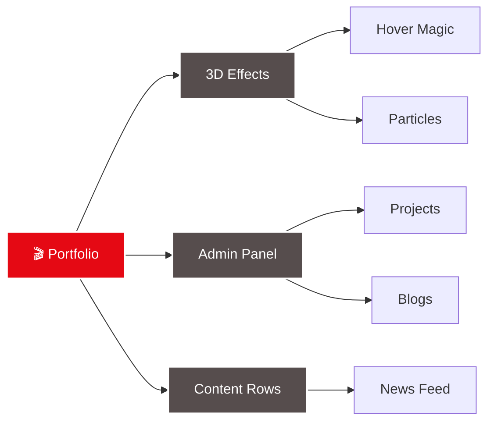
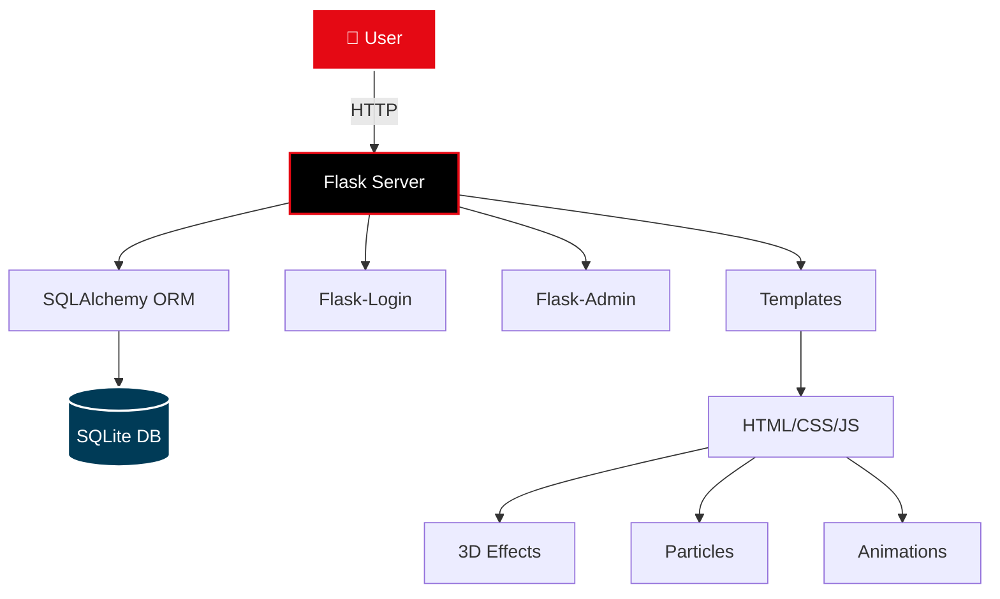

<div align="center">

# 🎬 Dhruvi Mittal's Cinematic Portfolio


<p align="center">
  
  
  
  
</p>

<p align="center">
  <a href="#-features">Features</a> •
  <a href="#-quick-start">Quick Start</a> •
  <a href="#-showcase">Showcase</a> •
  <a href="#-tech-stack">Tech Stack</a> •
  <a href="#-about">About</a>
</p>

```ascii
╔════════════════════════════════════════════════════════════════╗
║  🌟 A Netflix-Inspired Developer Portfolio Experience 🌟      ║
║  3D Effects • Particle Magic • Cinematic Animations           ║
╚════════════════════════════════════════════════════════════════╝
```

</div>

---

## ⚡ Quick Start

<details open>
<summary><b>🚀 One-Command Setup</b></summary>

```bash
# Step-by-step setup
git clone https://github.com/Dhruvi-tech/Portfolio
cd Portfolio
pip install -r requirements.txt
python reset_db.py
python app.py
```

</details>

<details>
<summary><b>📋 Step-by-Step Installation</b></summary>

```bash
# 1️⃣ Clone the repository
git clone https://github.com/Dhruvi-tech/netflix-portfolio
cd netflix-portfolio

# 2️⃣ Install dependencies
pip install -r requirements.txt

# 3️⃣ Setup environment
cp .env.example .env
# Edit .env with your SECRET_KEY

# 4️⃣ Run locally
python run.py
```

</details>

<div align="center">

### 🌐 Access Points

| Service | URL | Description |
|---------|-----|-------------|
| 🏠 **Main Site** | `http://localhost:5000` | Portfolio Experience |
| 🔧 **Admin Panel** | `http://localhost:5000/admin` | Content Management |

> ⚠️ **Local Optimized**: Built for localhost performance, not production deployment

</div>

---

## ✨ Features

<table>
<tr>
<td width="50%">

### 🎨 Visual Excellence
```
✓ 3D Card Hover Effects
✓ Glowing Neon Shadows
✓ Particle Background
✓ Mouse Parallax
✓ Cinematic Loading
✓ Typing Hero Animation
✓ Netflix Horizontal Rows
✓ Smooth Transitions
```

</td>
<td width="50%">

### 🛠️ Technical Power
```
✓ Mobile-First Design
✓ GPU Acceleration
✓ Lazy Loading
✓ Admin Dashboard
✓ Real-time Updates
✓ Secure Auth
✓ SQLite Database
✓ Responsive Grid
```

</td>
</tr>
</table>

<div align="center">

### 🎯 Feature Highlights



</div>

---

## 🎬 Showcase

### 💼 Featured Projects Row

<div align="center">

| Project | Stack | Stars | Status |
|---------|-------|-------|--------|
| **🐳 Quote App** |    | ⭐⭐⭐⭐ | 🟢 Active |
| **🔐 File Encryption** |   | ⭐⭐⭐⭐⭐ | 🟢 Active |
| **☁️ Secure Backup** |    | ⭐⭐⭐⭐ | 🟢 Active |
| **💬 Firebase Chat** |   | ⭐⭐⭐⭐ | 🟢 Active |
| **🎨 This Portfolio** |   | ⭐⭐⭐⭐⭐ | 🟢 Active |

[🔗 View All Projects →](#)

</div>

### 📝 Latest Blog Posts

<table>
<tr>
<td align="center" width="20%">
<br/>
<b>Multi-Cloud Security</b><br/>
<sub>☁️ Cloud Security</sub>
</td>
<td align="center" width="20%">
<br/>
<b>K8s Hardening</b><br/>
<sub>🛡️ DevOps Security</sub>
</td>
<td align="center" width="20%">
<br/>
<b>Infrastructure as Code</b><br/>
<sub>⚙️ Automation</sub>
</td>
<td align="center" width="20%">
<br/>
<b>Zero Trust Architecture</b><br/>
<sub>🔐 Security</sub>
</td>
<td align="center" width="20%">
<br/>
<b>AI in Cybersecurity</b><br/>
<sub>🤖 AI Security</sub>
</td>
</tr>
</table>

### 📰 Tech News Feed

<div align="center">

| 🔥 Trending | Category | Impact |
|-------------|----------|--------|
| 🧠 **AI-Powered Threat Detection** | Artificial Intelligence |  |
| ☁️ **Cloud Security Trends 2025** | Cloud Computing |  |
| 🛡️ **K8s CVE Vulnerabilities** | DevOps Security |  |
| ⚠️ **Latest Zero-Day Exploits** | Cybersecurity |  |
| ⚡ **Quantum Computing Impact** | Emerging Tech |  |

</div>

---

## 🛠️ Tech Stack

<div align="center">

### Backend Architecture


### Frontend Magic


### Tools & Utilities


</div>

<details>
<summary><b>📊 Architecture Diagram</b></summary>



</details>

---

## 🔐 Admin Panel

<div align="center">

### 🎛️ Content Management System

</div>

<table>
<tr>
<td width="33%">

#### 📁 Projects
```
• Add/Edit/Delete
• GitHub Integration
• Tech Stack Display
• Live Preview
• Image Upload
```

</td>
<td width="33%">

#### ✍️ Blog Posts
```
• Markdown Support
• Category Tags
• SEO Optimization
• Draft/Publish
• Scheduling
```

</td>
<td width="33%">

#### 📰 News Feed
```
• Real-time Updates
• Source Links
• Topic Filtering
• Trending System
• Auto-Archive
```

</td>
</tr>
</table>

<details>
<summary><b>🔑 Create Admin User</b></summary>

```python
from app import app, db, User
from werkzeug.security import generate_password_hash

with app.app_context():
    admin = User(
        username='admin',
        email='admin@example.com',
        password_hash=generate_password_hash('SecurePassword123!')
    )
    db.session.add(admin)
    db.session.commit()
    print("✅ Admin user created successfully!")
```

</details>

---

## 👤 About Dhruvi Mittal

<div align="center">


### 🎓 Education & Location
**B.Sc. (Hons) Cloud Computing** | 📍 Bengaluru, India 🇮🇳

### 💡 Specializations
**Cybersecurity** • **Cloud Architecture** • **AI/ML Security** • **DevSecOps**

</div>

<table align="center">
<tr>
<td align="center" width="25%">
<br/>
<b>AWS</b>
</td>
<td align="center" width="25%">
<br/>
<b>GCP</b>
</td>
<td align="center" width="25%">
<br/>
<b>Azure</b>
</td>
<td align="center" width="25%">
<br/>
<b>Docker</b>
</td>
</tr>
<tr>
<td align="center" width="25%">
<br/>
<b>Kubernetes</b>
</td>
<td align="center" width="25%">
<br/>
<b>Terraform</b>
</td>
<td align="center" width="25%">
<br/>
<b>Python</b>
</td>
<td align="center" width="25%">
<br/>
<b>React</b>
</td>
</tr>
</table>

<div align="center">

### 🌐 Connect With Me

[](https://www.linkedin.com/in/dhruvi-mittal/)
[](https://github.com/Dhruvi-tech)
[](mailto:dhruvi@example.com)
[](#)

</div>

---

## 🤝 Contributing

<div align="center">

We love contributions! Here's how you can help make this project even better:

</div>


<details>
<summary><b>📋 Contribution Guidelines</b></summary>

1. **Fork** the repository
2. **Create** a feature branch (`git checkout -b feature/AmazingFeature`)
3. **Commit** your changes (`git commit -m '✨ Add AmazingFeature'`)
4. **Push** to the branch (`git push origin feature/AmazingFeature`)
5. **Open** a Pull Request

### Code Standards
- Follow PEP 8 for Python code
- Use meaningful commit messages
- Add comments for complex logic
- Test before submitting PR

</details>

---

## 📄 License

<div align="center">

This project is licensed under the **MIT License**

[](LICENSE)

*Free to use, modify, and distribute with attribution*

</div>

---

## 📊 Project Stats

<div align="center">


</div>

---

## 💖 Support

<div align="center">

If you find this project helpful, please consider:

⭐ **Starring** the repository
🐛 **Reporting** bugs and issues
💡 **Suggesting** new features
🔀 **Contributing** code improvements

### Show Your Support

[](https://github.com/Dhruvi-tech/netflix-portfolio)
[](https://github.com/Dhruvi-tech)

</div>

---

<div align="center">

### 🌟 Special Thanks

*To all contributors and supporters who make this project possible*


**Built with ❤️ by Dhruvi Mittal**

*"Securing the digital world, one line of code at a time"* 🔐

[](https://github.com/Dhruvi-tech)

</div>
